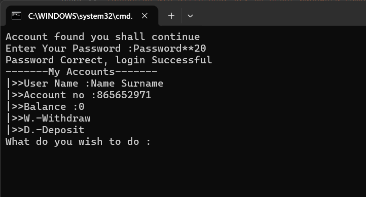

# 🏦 Banking System (C++)

A secure, console-based banking application built with C++ as a learning project.  
It demonstrates object-oriented design, password hashing, file persistence, and efficient data structures.

## ✨ Features
- ✅ Create new bank accounts with password
- ✅ Secure password hashing (with salt and key stretching)
- 🔄 Login with account number and password (inprocess)
- ✅ Deposit and withdraw funds
- ✅ Persistent storage (accounts saved to file)
- ✅ Fast account lookup using vector + hash map hybrid
- ✅ Password strength validation
- 🔄 Transaction history (planned)
- 🔄 GUI version with Qt (future enhancement)

## 🚀 How to Build and Run

### Prerequisites
- C++17 compatible compiler (g++, MinGW, etc.)

### Compile
Open a terminal in the project folder and run:

g++ src/*.cpp -o bin/banking.exe
or Use the provided batch file to compile and run

## 📁 Project Structure

BankSystem/
│
├── .gitignore
├── BankSystem.cbp
├── BankSystem.depend
├── BankSystem.layout
├── build.bat
├── README.md
│
├── data/
│   └── data_file.dat
│
├── images/                       <-- New folder for screenshots
│   ├── CreatingNewAccout_Screen.png
│   ├── CurrentMenu_Screen.png
│   └── Logged_Screen.png  
│
└── src/
    ├── BankAccount.cpp
    ├── BankAccount.h
    ├── BankDataBase.cpp
    ├── BankDataBase.h
    ├── LibFunctions.cpp
    ├── LibFunctions.h
    ├── main.cpp
    ├── PasswordManager.cpp
    └── PasswordManager.h

	
## 🧪 What I Learned
Implementing a secure password hashing algorithm with salt

Using std::vector for fast lookups (to be improved, currently on O(n)

File I/O for persistent data storage

Object-oriented design with multiple classes and namespaces

Defensive programming (input validation, error handling)	

## 🚧 Status
This project is a work in progress. Core banking operations work, but I plan to add:
Exception handling when dealing with files

Improve the menu after the user successfully loged into their account
See how current menu looks

Transaction history

Account locking after failed attempts

A graphical user interface using Qt

